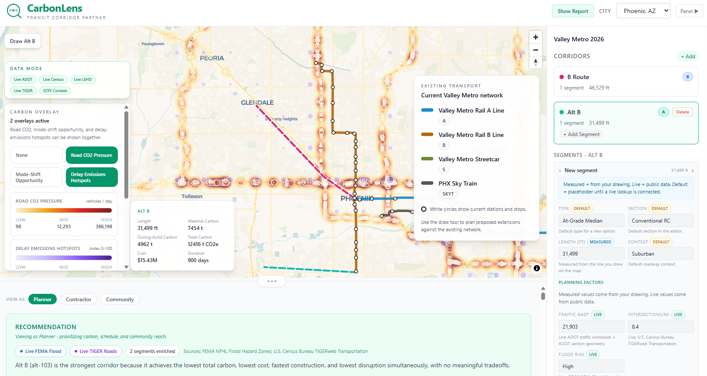
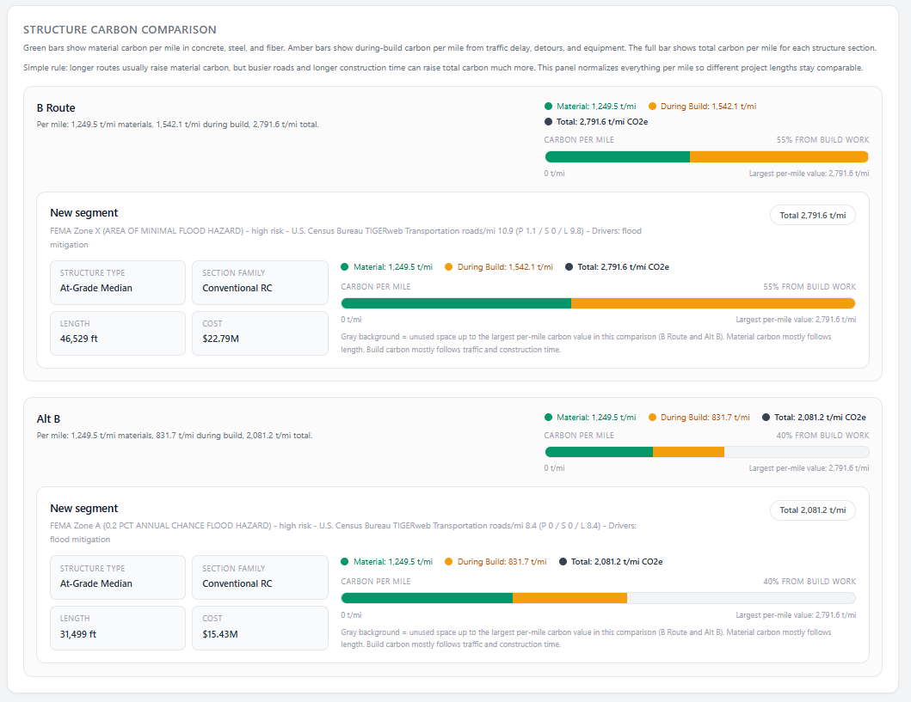
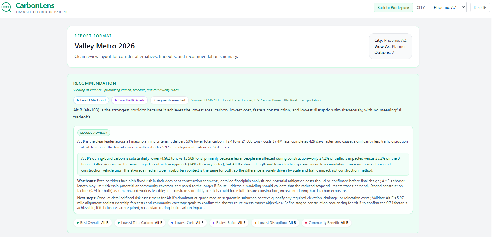
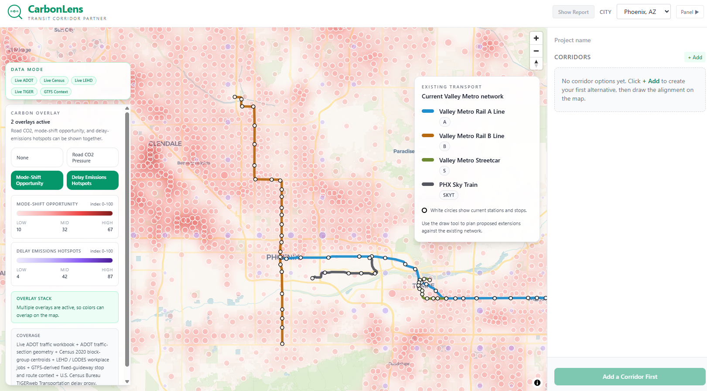

# CarbonLens

**Transit Corridor Partner**

CarbonLens is a transit corridor planning tool that compares rail alternatives by embodied carbon, construction emissions, cost, buildability, and community benefit using live public data — helping agencies choose the lowest-carbon, most buildable route.

Built for **Innovation Hacks 2.0** — Amazon Sustainability Track (April 2026).

🌐 **Live demo:** [regal-faloodeh-9fd58e.netlify.app](https://regal-faloodeh-9fd58e.netlify.app/)

---

## Screenshots

| Map Workspace | Report View |
|---|---|
|  |  |

| Corridor Comparison | Section Tradeoffs |
|---|---|
|  |  |

---

## What it does

1. **Draw** rail corridor alternatives directly on the map
2. **Enrich** each segment with live public data (traffic, population, jobs, flood risk, road network)
3. **Analyze** embodied carbon, during-build carbon, cost, duration, disruption, buildability, and community benefit
4. **Compare** corridors with three stakeholder lenses — Planner, Contractor, Community
5. **Advise** with optional Claude AI narrative grounded in deterministic results

## Carbon Model

$$C_{\text{total}} = C_{\text{material}} + C_{\text{construction}}$$

### Material Carbon

$$C_{\text{material}} = \sum_{i} \left( V_i \times \rho_i \times EF_i \right)$$

Each segment computes concrete volume from slab thickness and width, then adds reinforcement carbon:

| Section Family | Slab | Rebar | Fiber | Concrete Mix | Production |
|---|---|---|---|---|---|
| Conventional RC | 14 in | 240 lb/cy | — | Standard (15% SCM) | 35 lf/day |
| Fiber Reinforced (FRC) | 12 in | — | 60 lb/cy | Fiber Mix (15% SCM) | 55 lf/day |

Material emission factors (ICE v3):
- Rebar: 0.90 kg CO₂e/lb
- Steel fiber: 1.03 kg CO₂e/lb
- Standard concrete: 290 kg CO₂e/cy
- Fiber mix concrete: 275 kg CO₂e/cy

### During-Build Carbon

$$C_{\text{construction}} = C_{\text{idle}} + C_{\text{detour}} + C_{\text{equipment}}$$

where:

$$C_{\text{idle}} = AADT \times \alpha \times d \times \delta_{\text{delay}} \times ef_{\text{idle}}$$

$$C_{\text{detour}} = AADT \times \beta \times d \times \Delta L \times ef_{\text{detour}}$$

$$C_{\text{equipment}} = P_{\text{equip}} \times d$$

| Parameter | Value | Source |
|---|---|---|
| $ef_{\text{idle}}$ | 8.16 kg CO₂/vehicle-hour | EPA avg passenger vehicle |
| $ef_{\text{detour}}$ | 0.404 kg CO₂/mile | EPA avg passenger vehicle |
| $\delta_{\text{delay}}$ | 0.05 hours (3 min) | FHWA work-zone delay |
| $\Delta L$ | 1.5 miles | FHWA urban arterial detour |
| $P_{\text{equip}}$ | 2,500 kg CO₂/day | Industry avg LRT equipment |
| $\alpha$ (affected share) | 10–50% of AADT | Context-adjusted |
| $\beta$ (detour share) | 4–22% of AADT | Context-adjusted |

The affected traffic share $\alpha$ adjusts for corridor context (urban core +15%, suburban −8%), segment type (embedded street +12%, elevated −15%), constrained ROW (+8%), and night work (−5%). A staged construction factor (0.65–1.05) further scales daily exposure.

### Why This Matters

Two routes can have similar material carbon but very different total carbon because during-build carbon follows traffic exposure and construction duration, not just structure. FRC saves carbon in two ways: thinner slabs reduce material volume, and faster production (55 vs. 35 lf/day) shortens the construction window — reducing traffic-delay emissions by up to 84% of the total benefit.

## Live Public Data Sources

| Source | Data |
|---|---|
| ADOT Traffic Sections | AADT and roadway geometry |
| U.S. Census TIGERweb | Block-group population and road network density |
| Census ACS 2023 | Zero-vehicle household share |
| LEHD / LODES | Workplace jobs by block group |
| FEMA NFHL | Flood hazard zones |
| TIGERweb Transportation | Road-network constructability proxy |
| GTFS-derived context | Fixed-guideway stop and route connectivity |

## Tech Stack

| Layer | Technology |
|---|---|
| Frontend | React 18, Vite 5, Tailwind CSS 3, Recharts |
| Maps | MapLibre GL JS |
| Backend | Netlify Functions (Node.js) |
| Analysis | Deterministic JavaScript engine |
| AI Layer | Anthropic Claude API (advisory only) |
| Deploy | Netlify |

## Getting Started

```bash
# Install frontend dependencies
cd src/frontend && npm install

# Install function dependencies
cd ../../netlify/functions && npm install

# Run dev server
cd ../.. && npx netlify dev
```

The app runs at `http://localhost:8888`.

## Project Structure

```
├── CLAUDE.md                     # Project rules and architecture
├── netlify.toml                  # Build and deploy config
├── netlify/functions/            # Serverless API endpoints
│   ├── analyze.js                # Deterministic corridor analysis
│   ├── background-overlays.js    # Live public data overlays
│   └── ai-corridor-advisor.js    # Claude AI narrative advisor
├── src/
│   ├── frontend/src/
│   │   ├── App.jsx               # Main layout
│   │   ├── api.js                # API client
│   │   └── components/           # React components
│   ├── backend/analysis/
│   │   ├── transitCarbonEngine.js    # Core analysis engine
│   │   ├── transitConstants.js       # Editable rates and factors
│   │   └── transitScenarioPresets.js # City presets
│   └── shared/
│       └── fixedGuidewayAnchors.js   # Phoenix transit network model
├── docs/                         # Decisions, handoff, project story
├── specs/                        # Feature specifications
└── pics/                         # Screenshots and media
```

## Environment Variables

| Variable | Required | Purpose |
|---|---|---|
| `ANTHROPIC_API_KEY` | Optional | Enables Claude AI advisor narrative |

## Team

Built by ASU students at Innovation Hacks 2.0.

## License

MIT
